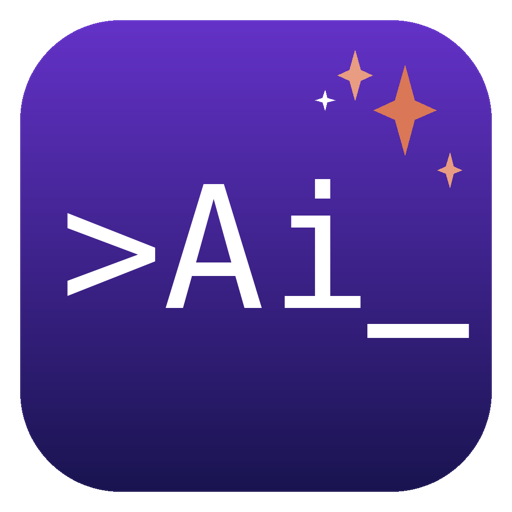
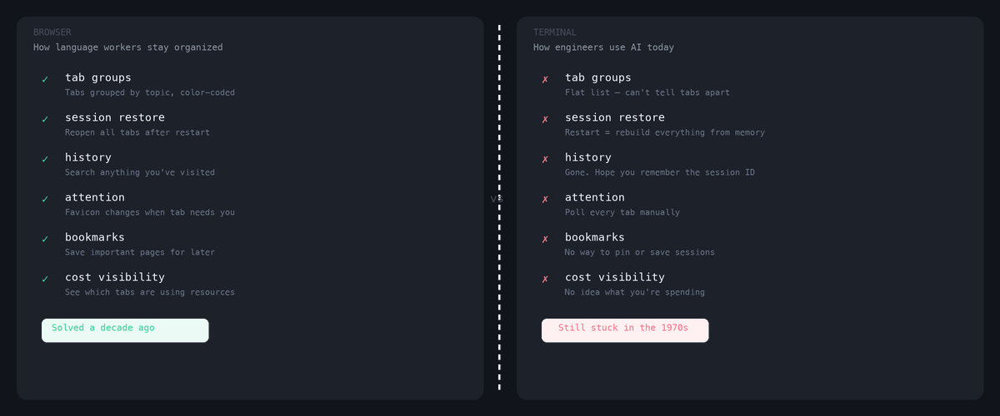
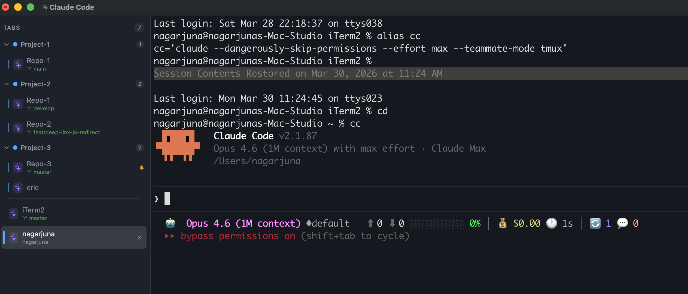
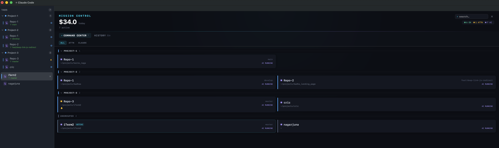
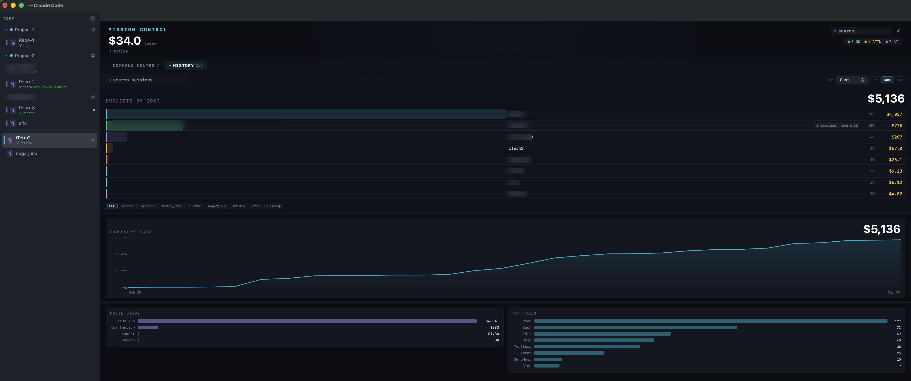
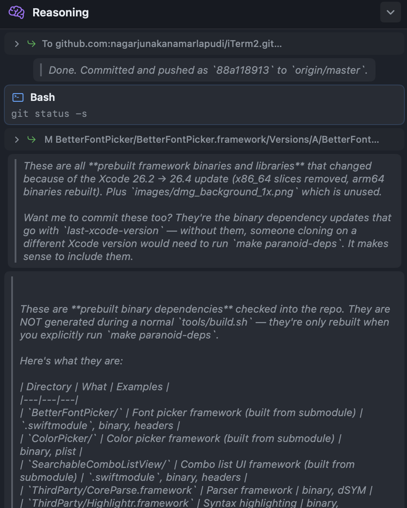

# Claude Asked Permission in 3 Tabs. I Didn't Notice for 3 Hours.

### How I built a terminal that manages AI sessions like a browser manages tabs

I was deep in a refactor. One of those flow states where the code is pouring out and you forget to eat. Claude was rewriting my auth module in tab 3 while I worked alongside it in tab 7, reviewing test output.

Three hours later, I stretched, grabbed coffee, and started clicking through my other terminal tabs.

Tab 11. Claude had asked to modify a production config. It was waiting for my "yes."

Tab 5. Claude needed permission to delete and recreate a database migration. Also waiting.

Tab 14. Claude wanted to run a shell command with sudo. Waiting.

Three tabs. Three permission prompts. Three hours of dead time. Claude had been sitting there, cursor blinking, while I had no idea anything was wrong. No notification. No badge. No sound. Just silent, patient text in a tab I wasn't looking at.

I didn't lose code that day. But I lost three hours of parallel work across three sessions -- time I could never get back. And the worst part? I didn't even know it was happening.

> *I had 14 AI sessions open. Not one of them could tap me on the shoulder.*

---

## My Browser Would Never Do This to Me

That night, I opened Chrome and stared at it. Really stared at it.

Forty-two tabs. Grouped by project -- blue for work, green for personal, orange for research. A favicon spinning on a tab that was still loading. A tiny speaker icon on the tab playing audio. When I'd restarted my laptop last week, every single tab came back exactly where I left it.

Then I looked at my terminal. Fourteen tabs. Identical. Flat. No groups. No status indicators. No way to know which one had Claude running, which one was idle, which one needed me. A wall of indistinguishable rectangles.

The browser had solved this problem a decade ago. Tab groups. Favicons that change when a page wants attention. Session restore. Searchable history. These aren't features -- they're infrastructure. They're what makes it possible to have 40 tabs open and still function as a human.

My terminal had none of it. And it didn't matter when terminals were for running `make` and tailing logs. But AI turned the terminal into the center of engineering work. I type a sentence and Claude writes, refactors, tests, and commits. The terminal is where I *think* -- in natural language -- and the AI executes.

Your interface to code is now language. The terminal hasn't caught up.

That mismatch is the tax on your 10X velocity. You're building at unprecedented speed, then burning a chunk of it wondering which tab was your auth refactor, whether a restart killed your session state, and whether tab 11 has been waiting for you since lunch.

---

## So I Built What Was Missing

Netra is a fork of iTerm2 -- the terminal millions of developers already use. I didn't want to reinvent the shell. Warp and others have done interesting work modernizing the single-terminal experience. I wanted to solve a different problem: managing the fleet. Not a better shell. A cockpit for the 10 AI sessions running inside it.

I wrote 10,745 lines of Swift and Objective-C in three days -- yes, with Claude's help. That's kind of the point.

### Your Tabs Know What They Are

Every tab knows its project, its git branch, its working directory, and whether Claude is running inside it. Tabs group themselves by project automatically. The vertical sidebar shows it all at a glance -- and more importantly, it shows you *status*.

Cyan dot: Claude is working. Amber badge: Claude needs your permission. Rose: something died.

I stopped polling. For the first time since I started using Claude Code, I could focus on one session and trust that the other nine would interrupt me *only when they needed to*.

That's the browser paradigm. Favicons change when a tab wants attention. Now your terminal does the same.

### Your Sessions Survive Everything

Restart your Mac. Netra brings back every tab, every group, every position -- and the Claude session IDs that let you resume exactly where you left off. One click. No more digging through `~/.claude` trying to find the right session file for a conversation you started yesterday.

Browsers restore your tabs. Now your terminal does too.

### 843 Sessions. All Searchable. All Resumable.

Hit **Cmd+Option+B** and Mission Control opens. Every session you've ever run -- 843 of them, in my case, across 25 projects -- cataloged and searchable. Search by the prompt you typed, the project, the git branch. Find the session from last Tuesday where you asked Claude to optimize that database query.

Resume it in a new tab with one click. That session from three weeks ago where you solved that gnarly race condition? It's still there. Every prompt, every cost, every tool call.

---

## And Then I Discovered Something Worse

Once Mission Control could see all my sessions, I built a cost engine. A scanner that reads every JSONL transcript on your machine -- every conversation you've ever had with Claude Code -- and calculates what you actually spent, accounting for all four token types the Anthropic API returns: input, output, cache reads, and cache creation.

I had 591 transcripts. 430 megabytes of conversation history across 25 projects. I knew it was expensive. I figured maybe a couple thousand dollars.

The number that came back: **$6,762.**

The cache tokens were the eye-opener. **1.6 billion** cache_read tokens for Opus alone. At $1.50 per million, that's $2,400 just in cache reads. For Opus, input and output tokens were less than 2% of my real cost. The cache was everything.

> *When you're running 10+ sessions across 25 projects, you need cost visibility baked into the same place you manage your sessions -- not in a separate tool you have to remember to check.*

Netra puts it front and center. Per-session, per-project, per-model. I'd been making decisions about which model to use, which projects to prioritize, and how to structure my prompts without this context. Now I could see.

---

## So I Built the Cost Data Into Mission Control

Once the scanner existed, the question was obvious: where do you *put* all this data? Mission Control became the answer -- not a settings page, but an operations center.

**Command Center** shows every active session as a card. Filter by status: all sessions, those needing attention, actively running Claude, dead sessions, pinned favorites. Each card shows the working directory, git branch, agent status, and a context fill bar -- how close Claude is to hitting its context limit. Click any card for full vitals: duration, tokens, cost, tool usage.

The total cost counter sits at the top of the screen, ticking upward like a taxi meter. When you're spending $15 per million input tokens on Opus, you want to see the meter running. It's not vanity. It's operational awareness.

**The History panel** makes all the cost data visible. Project-level cost breakdowns. A cumulative cost line rising over time. Model split between Opus, Sonnet, and Haiku. Tool usage showing what Claude reaches for most.

**The reasoning overlay** is my favorite detail. A floating panel that tails Claude's transcript in real-time, showing thinking blocks and tool calls as they stream. It auto-fades after 5 seconds so it never blocks your work. You can see what Claude is thinking without switching tabs, without breaking your flow.

---

## The Gap Is Only Getting Wider

Every month, Claude gets faster. Context windows grow. More engineers run more sessions across more projects. The velocity compounds -- but so does the chaos if your terminal can't keep up.

The browser paradigm isn't a metaphor. It's a blueprint. Tab groups, session restore, history, search, attention routing, cost visibility -- these are the primitives that make it possible to work at scale with language as your primary tool. Browsers built them for one kind of knowledge work. Terminals need them for another.

**Netra is coming soon.** I'm preparing to open-source it — follow along on [Twitter](https://twitter.com/nagarjuna) / [LinkedIn](https://linkedin.com/in/nagarjuna) to get notified when it drops.

In the meantime, drop a comment with your worst "which tab broke my code" story. I want to hear what this problem looks like for you.

> *Your browser learned to manage your attention years ago. It's time your terminal did too.*

---

*-- Nagarjuna*

*10,745 lines of Swift & Obj-C | 591 transcripts scanned (430MB) | 843 sessions cataloged across 25 projects | 5 data sources merged | 3 days from first line to shipping a DMG*
